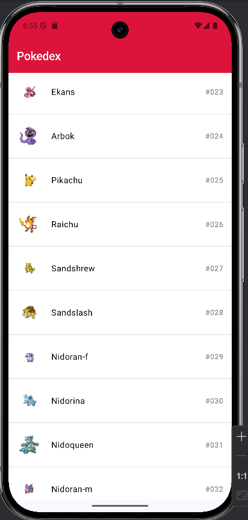
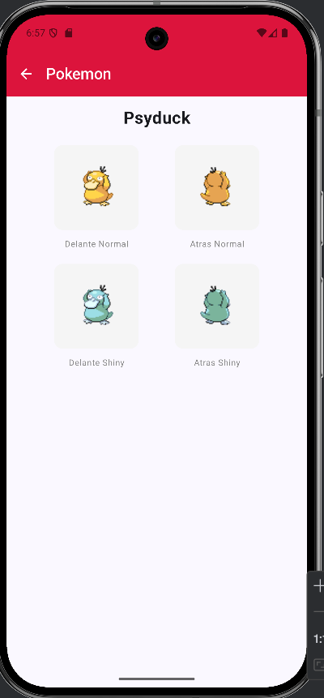

## Laboratorio 5 - Programación de Plataformas Móviles
Una aplicación Android moderna desarrollada con Jetpack Compose que permite explorar los primeros 100 Pokémon utilizando la PokéAPI.

____
## CAMBIOS EN EL LABORATORIO 6

### 🏗️ Arquitectura - MVVM con Clean Architecture

Este proyecto implementa una arquitectura de tres capas claramente separadas:

### 📂 Estructura de Capas

```bash
com.example.laboratorio5/
│
├── ui/                          # 🎨 CAPA DE PRESENTACIÓN
│   ├── MainActivity.kt          # Activity principal
│   ├── MainViewModel.kt         # ViewModel con StateFlow
│   ├── PokemonApp.kt            # Configuración de navegación
│   ├── MainScreen.kt            # Pantalla de lista de Pokémon
│   └── DetailScreen.kt          # Pantalla de detalle
│
├── data/                        # 💾 CAPA DE DATOS
│   ├── repository/
│   │   └── MainRepository.kt    # Intermediario entre ViewModel y datos remotos
│   │
│   ├── remote/
│   │   ├── ApiService.kt        # Interface de Retrofit
│   │   └── RetrofitClient.kt    # Configuración de Retrofit
│   │
│   └── model/
│       └── Pokemon.kt           # Modelos de datos y DTOs
│
└── ui/theme/                    # 🎨 TEMA DE LA APLICACIÓN
```

### 🔄 Flujo de Datos

```bash
UI (Compose) ←→ ViewModel (StateFlow) ←→ Repository ←→ ApiService (Retrofit) ←→ PokéAPI
```

**1. UI Layer (Presentación):**
- `MainActivity`: Punto de entrada de la aplicación
- `MainScreen` & `DetailScreen`: Composables que observan el estado del ViewModel
- Responsabilidad: Renderizar UI y manejar interacciones del usuario

**2. ViewModel Layer:**
- `MainViewModel`: Maneja el estado de la UI usando `StateFlow`
- `MainUiState`: Data class que contiene el estado (lista, loading, errores)
- Responsabilidad: Lógica de presentación y gestión del estado

**3. Repository Layer:**
- `MainRepository`: Única fuente de verdad para los datos
- Responsabilidad: Coordinar entre fuentes de datos (API, cache, BD)

**4. Data Source Layer:**
- `ApiService`: Interface de Retrofit con endpoints definidos
- `RetrofitClient`: Configuración singleton de Retrofit
- Responsabilidad: Comunicación HTTP con la API

#### **Beneficios de esta Arquitectura**

- ✅ ***Separación de Responsabilidades:*** Cada capa tiene una función específica
- ✅ ***Testeable:*** Cada componente puede probarse de forma independiente
- ✅ ***Escalable:*** Fácil agregar nuevas features sin afectar código existente
- ✅ ***Mantenible:*** Código organizado y fácil de entender
- ✅ ***Reusable:*** Los repositorios y servicios pueden compartirse entre ViewModels
- ✅ ***Reactivo:*** StateFlow permite actualizaciones automáticas de la UI

#### **Patrones Implementados**

- ***MVVM (Model-View-ViewModel):*** Separación entre lógica de UI y datos
- ***Repository Pattern:*** Abstracción de la fuente de datos
- ***Singleton Pattern:*** Instancia única de Retrofit
- ***Observer Pattern:*** StateFlow para observar cambios de estado
- ***Dependency Injection:*** Inyección manual de dependencias
___

### 📱 Características
- Visualiza los primeros 100 Pokémon con imagen, nombre y número de Pokédex
- Navega entre la lista principal y los detalles de cada Pokémon
  Detalles del Pokémon: Vista detallada con múltiples sprites (normal, shiny, frontal, trasero)
- Interfaz diseñada con Material Design 3 y Jetpack Compose
- Carga asíncrona con imágenes cargadas de forma eficiente con Coil

### 🛠️ Tecnologías Utilizadas
- ***Kotlin:*** Lenguaje de programación principal
- ***Jetpack Compose:*** Framework de UI moderno para Android
- ***Material Design 3:*** Sistema de diseño de Google
- ***Coil:*** Librería para carga de imágenes
- ***Navigation Compose:*** Navegación entre pantallas
- ***Coroutines:*** Programación asíncrona
- ***PokéAPI:*** API REST para datos de Pokémon

### 📋 Requisitos
- Android Studio Arctic Fox o superior
- SDK de Android 21 o superior
- Kotlin 1.8.0 o superior
- Conexión a internet para cargar datos y sprites

### 🚀 Instalación
**1. Clonar el repositorio**
```bash
https://github.com/MarceloDetlefsen/Laboratorio_5_PM.git
cd Laboratorio5_PM
```
**2. Abrir en Android Studio**

Abrir Android Studio
Seleccionar "Open an existing project"
Navegar hasta la carpeta del proyecto

**3. Sincronizar dependencias**

Android Studio automáticamente sincronizará las dependencias de Gradle

### 🎨 Diseño

**Colores**

- Color primario: Rojo (#DC143C) - Inspirado en las Pokéballs
- Fondo: Blanco para una experiencia limpia
- Texto: Negro para máxima legibilidad

**Componentes UI**

- TopAppBar: Barra superior con título y navegación
- LazyColumn: Lista optimizada para scroll fluido
- Cards: Contenedores para elementos de la lista
- AsyncImage: Carga eficiente de imágenes de sprites

### 🌐 API Utilizada
PokéAPI: https://pokeapi.co/api/v2/pokemon

- Endpoint principal: /pokemon?limit=100
- Sprites: https://raw.githubusercontent.com/PokeAPI/sprites/master/sprites/pokemon/

**Tipos de Sprites**

- Normal frontal: pokemon/{id}.png
- Normal trasero: pokemon/back/{id}.png
- Shiny frontal: pokemon/shiny/{id}.png
- Shiny trasero: pokemon/back/shiny/{id}.png

### 📷 Capturas del Programa

**Lista de Pokemones**



**Vista Pokemon Específico**



### 👨‍💻 Autor

Marcelo Detlefsen - 24554